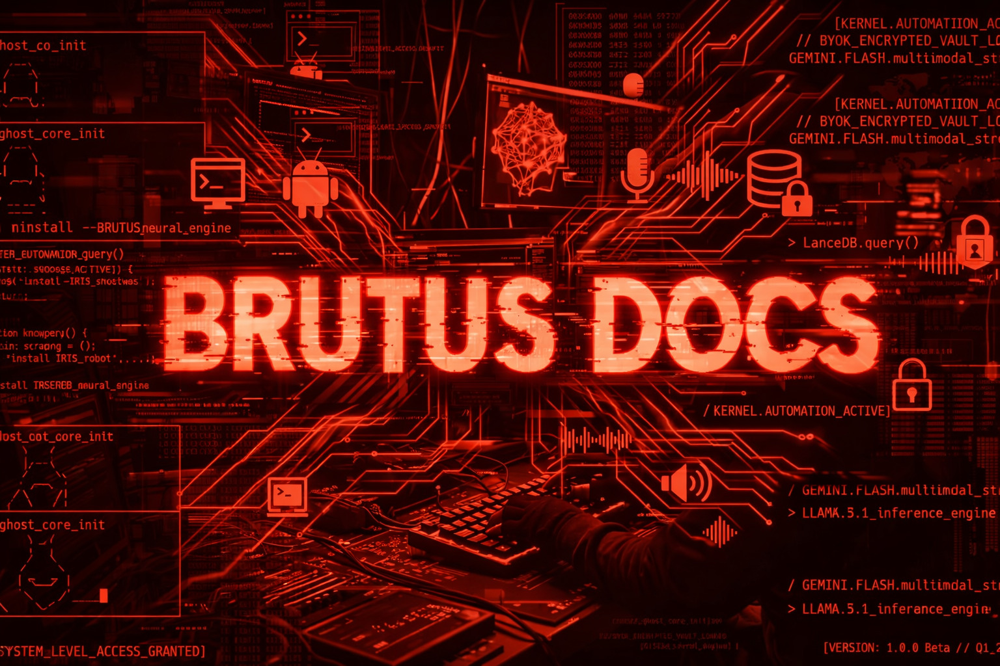
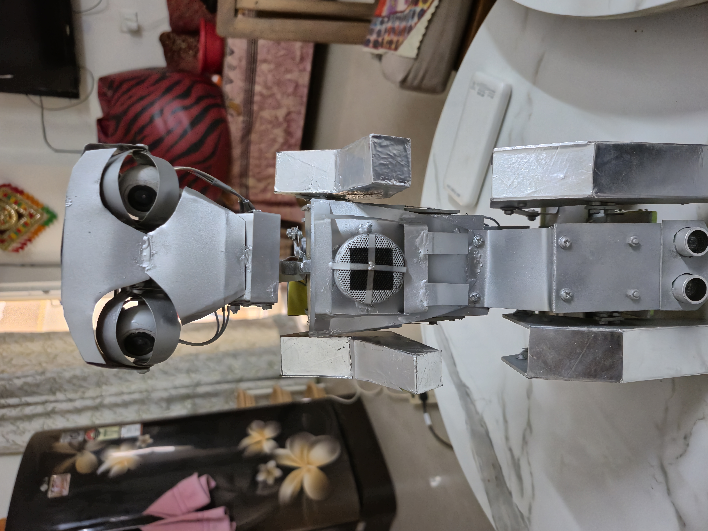
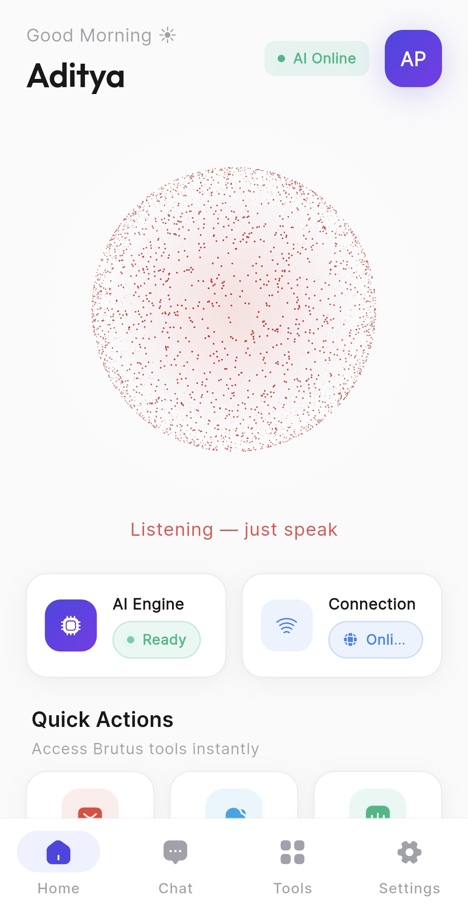
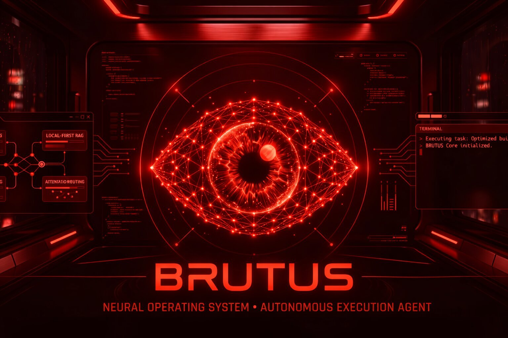

<div align="center">



<br/>
<br/>

# BRUTUS

### The AI Orchestration Engine

**Brutus does not answer questions. It runs a workforce.**

Real coding agents on a canvas, wired to each other. Eight LLM specialists working a task in parallel. An inbox that triages itself. A voice loop that runs with the network unplugged. A robot face that lip-syncs the reply. One engine, one policy layer, one place to watch it all happen.

<br/>

[](#-studio--the-agent-canvas)
[](#-orchestrator--eight-specialists-in-parallel)
[](#-desk--the-inbox-that-runs-itself)
[](#edge-first-by-design)

[](https://www.electronjs.org)
[](https://react.dev)
[](https://www.typescriptlang.org)
[](#testing)
[](LICENSE)

<br/>

**[Demo video](https://drive.google.com/file/d/1iEQ8_0RgrJ_upc7SoQQ_h8_tGQfKDFlC/view?usp=drive_link)**
·
**[Presentation](https://drive.google.com/file/d/10COwSTOePot8Zara3cNQorNXDBU2ZgEv/view?usp=drive_link)**
·
**[Mobile app](https://github.com/Aditya060806/Brutus-app)**
·
**[Brain Node server](https://github.com/Aditya060806/Ai-Qualcom-backend)**

</div>

---

## Team Brutus

| Name | Email |
|:--|:--|
| Aditya Pandey | aditya060806@gmail.com |
| Palak Rai | palakrai32323@gmail.com |
| Avik Srivastava | aviksrivastava786@gmail.com |

---

## Contents

**The idea**
* [What Brutus actually is](#what-brutus-actually-is)
* [The four engines](#the-four-engines)
* [A look around](#a-look-around)

**The engines**
* [Studio — the agent canvas](#-studio--the-agent-canvas)
* [Orchestrator — eight specialists in parallel](#-orchestrator--eight-specialists-in-parallel)
* [Desk — the inbox that runs itself](#-desk--the-inbox-that-runs-itself)
* [Voice and the face](#-voice-and-the-face)
* [Macros — the visual workflow builder](#-macros--the-visual-workflow-builder)

**Everything else it does**
* [The full capability catalogue](#the-full-capability-catalogue)

**How it is built**
* [Architecture](#architecture)
* [Edge first by design](#edge-first-by-design)
* [Every model, nothing left out](#every-model-nothing-left-out)
* [The robots](#the-robots)
* [Security posture](#security-posture)

**Getting it running**
* [Setup from scratch](#setup-from-scratch)
* [Configuration](#configuration)
* [Daily usage](#daily-usage)
* [Testing](#testing)
* [Repository map](#repository-map)
* [Platforms](#platforms)
* [References](#references)
* [License](#license)

---

## What Brutus actually is

Most AI tools are a single model behind a single text box. You ask, it answers, the conversation ends. That shape breaks the moment the work is bigger than one reply — when it needs three different models, or twenty tool calls, or forty minutes of unattended effort against a real repository.

Brutus is built for that second case. It is an **orchestration engine**: the layer that decides *who* does the work, *what* they are allowed to touch, *how* results move between them, and *what happens when one of them fails*.

Three things follow from that framing, and they are what make Brutus different from a chat app with plugins:

**It orchestrates real programs, not API calls.** Studio runs your actual Claude Code, Codex and Gemini CLIs as live terminals in draggable windows. Not reimplementations, not MCP shims — the real binaries in real pseudo-terminals, which means your existing Claude Max or ChatGPT subscription is what pays for the work.

**Every autonomous action passes one policy engine.** An agent asking to write a file, run a command or reach the network is a decision, and Brutus makes it deterministically: `allow`, `deny`, or `ask` — and `ask` genuinely blocks the agent until a human answers. Nothing that was not positively recognised is ever waved through, and a catastrophic command is refused at *every* autonomy level, including the most permissive one.

**The critical path stays on your hardware.** The voice loop — speech in, reasoning, speech out — runs on a Snapdragon X Elite NPU on your LAN, with an on-device Whisper model bundled in the installer as backup. Cloud is a labelled fallback you choose, never a silent default. Pull the network and Brutus keeps talking.

> **The one-line version:** Brutus is the control room. The models are the staff.

---

## The four engines

Four independent systems share one policy layer, one memory, one voice and one face.

| | Engine | What it orchestrates | The unit of work |
|:--:|:--|:--|:--|
| 🎛️ | **[Studio](#-studio--the-agent-canvas)** | Real coding-agent CLIs as live terminals on a canvas | A **workspace** — agents wired together, running for as long as the job takes |
| 🧠 | **[Orchestrator](#-orchestrator--eight-specialists-in-parallel)** | Eight LLM specialists across four providers, in parallel | A **run** — one request, planned, fanned out, criticised, synthesised |
| 📬 | **[Desk](#-desk--the-inbox-that-runs-itself)** | Your Gmail inbox, continuously | A **cycle** — triage, draft, hold for approval, track commitments |
| 🎙️ | **[Voice](#-voice-and-the-face)** | 121 tools across your machine, phone and robots | A **turn** — you speak, it acts, the face reacts |

They are not siloed. Studio's command bar uses the Orchestrator's planner. Desk drafts through the same provider that serves voice. The face reflects whichever engine is currently thinking.

---

## A look around

<div align="center">

<br/>
<sub><b>Home.</b> Optics feed and system telemetry on the left, the animated face in the centre with its live state, transcript on the right. The red button opens the voice loop; the tabs across the top are the engines.</sub>
</div>

<br/>

<div align="center">
<table>
<tr>
<td align="center" width="50%"><br/><sub><b>Macros.</b> Node-graph automation.</sub></td>
<td align="center" width="50%"><br/><sub><b>Phone.</b> Your Android, mirrored and driveable.</sub></td>
</tr>
</table>
</div>

---

# 🎛️ Studio — the agent canvas

> **The pitch:** your real coding agents, side by side, on one canvas, wired to each other, with Brutus opening them, typing into them, answering their permission prompts and routing one agent's output into the next.

<div align="center">

<br/>
<sub>Three agents live at once — Atlas on Claude Code, Vega and Orion on Codex — wired with handoff strings. The rail reads <code>3 agents · 3 running</code>; the command bar edits the canvas in plain English.</sub>
</div>

<br/>

<div align="center">

<br/>
<sub>The launcher. A workspace is a canvas plus the project it belongs to — start one on a folder you have, or clone straight from a URL.</sub>
</div>

### Why this is not MCP

Every window is a **real pseudo-terminal running the real binary**. Claude Code and Codex are full TUIs: they need a terminal to render into, they emit ANSI, they expect resize events. A pipe gets you none of that. So Studio uses `node-pty`, and the practical consequence is the one that matters — your existing subscription pays for the work, and you can take over any window by typing into it.

### What you can build on the canvas

| Node | What it is |
|:--|:--|
| **Agent** | Claude Code, Codex, or Gemini CLI in a live terminal, with a setup card for run mode and working directory |
| **Terminal** | A plain shell for the things that surround agents — dev servers, test watchers, git, builds |
| **Preview** | A live frame on whatever an agent just started serving. Detected from its output, opened beside it, tethered to it |
| **Note** | A sticky note, because a canvas of autonomous processes needs somewhere to write down what you are actually trying to do |

Edges are real data flow, not decoration:

* **Handoff** — the finished output becomes the next agent's prompt
* **Branch** — the same result fans out to several agents
* **Loop** — feeds back upstream: *"revise until the tests pass"*

### The three ways to drive it

**1. Drag it.** Drop agents from the dock, drag connections between them, click a string to change what it does.

**2. Say it.** The command bar takes plain English:

```
add a Claude Code agent and a Codex agent, then connect them
wire the reviewer back into the builder, revise until the tests pass
```

The model proposes; a validator disposes. Unknown agent kinds are dropped, agents that are not installed are dropped, references that resolve to nothing are dropped, self-links are dropped, and the batch is capped. A hallucinated node id costs one skipped operation instead of a corrupted workspace.

**3. Brief it.** The Dashboard turns one sentence into a crew that actually runs:

```
"add dark mode to the settings page and make sure nothing else broke"

    → Apollo  (claude)  builds it
    → Atlas   (codex)   reviews the diff
    → Orion   (gemini)  runs the tests and reports
```

Every step is tracked from dispatch to done, and every transition lands in Activity.

### The policy engine

This is the safety-critical heart of Studio, and it runs on three principles in priority order:

1. **Never auto-approve something not positively recognised.** An unknown tool or an unparseable command escalates to you. Silence is never consent.
2. **Containment beats intent.** A write inside the agent's working folder is ordinary work. The same write outside it is a different act, regardless of how reasonable the agent's explanation sounds.
3. **Some things are never auto-approved at any autonomy level.** `rm -rf /`, `mkfs`, `dd of=/dev/…`, fork bombs, `curl … | sh`, `git push --force`, `git reset --hard`, `git clean -fd`, `chmod 777`, `sudo`, `npm publish`, shutdown. The blast radius is unbounded and irreversible, so a human looks at it even in the most permissive mode.

Commands are checked **both whole and per segment**. Segments catch `git status && rm -rf /`, where a safe prefix would otherwise launder a dangerous suffix. The whole command catches `curl x | sh`, which splitting on `|` would hide as the harmless pair *"curl x"* and *"sh"*.

Three autonomy levels, and the catastrophic list is blocked in all three:

| Level | Behaviour |
|:--|:--|
| **Guarded** | Reads and recognised build commands run free. Writes inside the working folder are fine. Everything else asks. |
| **Strict** | Every write, every command and anything leaving the machine asks first. |
| **Autonomous** | Recognised work proceeds silently — intended to be paired with per-agent git worktrees. |

### Two permission tracks, one decision

```
  Claude Code  ──▶  real PreToolUse HTTP hook  ──┐
                    structured, deterministic     │
                                                  ├──▶  decide()  ──▶  allow · deny · ask
  Codex/Gemini ──▶  prompt watcher reads the TUI ─┘                            │
                    pattern-matched                                            ▼
                                                              agent BLOCKS until you answer
```

The policy server binds `127.0.0.1` only, on an OS-chosen ephemeral port, behind a per-session bearer token. The Claude hook is installed into `.claude/settings.local.json` — never the team-shared `settings.json` — deep-merged so existing hooks survive, tagged so removal touches nothing else, backed up before the first write, and fully reversible.

For agents with no hook system, the prompt watcher reads the terminal the way a human does. It answers a matched prompt **once** (a TUI redraws constantly; answering twice sends a stray keystroke into whatever came next), waits 350 ms for output to settle, and never invents an answer.

### Isolation, so parallel work is safe

Per-agent **git worktrees**: each agent gets its own branch in its own directory, sharing one object store. Two agents editing the same repository cannot overwrite each other because they are literally somewhere else. This is also what makes autonomous mode defensible — skipping prompts inside your working tree is reckless; doing it inside a scratch branch you merge deliberately is a different proposition.

It never force-pushes, never resets, never discards. Merges are `--no-ff` and only attempted when clean. A conflict aborts and hands the branch back to you by name. **The worst case is a branch left behind for you to look at.**

### Work survives you leaving

An agent mid-build is doing minutes of real work. Closing the workspace or switching tabs does **not** stop it:

* the terminals keep running in the main process
* routing keeps running, because a cascade in flight is delivering into live terminals
* coming back **re-adopts** every session and replays it with full scroll history

Ending a run is an explicit act instead — **Stop all** in the rail, or closing a window. Quitting Brutus tears everything down cleanly.

### Details that took the most work

<details>
<summary><b>Reading the terminal correctly</b></summary>

Routing one agent's output into another means answering "what did the human actually see?" exactly. Cleaning the raw byte stream with regexes handles the easy cases and quietly fails the real ones: `\x1b[2A\x1b[2K` moves the cursor up two rows and rewrites a line, so byte-order cleaning keeps both the draft *and* the correction. Erase-in-display, scroll regions and the alternate screen buffer have no byte-level equivalent at all. Wrapped lines look like hard newlines, so a long sentence arrives at the next agent chopped at 80 columns.

So the bytes go through a real terminal emulator (`@xterm/headless`) and Brutus reads the resulting screen — the same engine the UI displays with, so what gets routed and what you are looking at agree by construction.
</details>

<details>
<summary><b>Loop limits per cascade, not per edge</b></summary>

A cascade is one human prompt and everything it sets off. Loop counts are tracked per cascade rather than globally, because a global counter is wrong in a way that is hard to spot: a loop edge that hit its cap once would be dead forever, so the *second* thing you asked would silently not loop. Each new prompt starts fresh. Hard ceilings — 12 deliveries, depth 6 — are checked before any model is called, which is what stops `A→B→C→A` from draining your quota.
</details>

<details>
<summary><b>Previews are loopback-only</b></summary>

An agent's output is untrusted: it contains whatever the agent just read, including file contents and web pages. A URL harvested from that stream gets loaded in a frame inside Brutus, so anything but a loopback host is refused outright — a README mentioning `https://evil.example` must never become a live frame. The frame is sandboxed without top-level navigation, so a redirect in a preview cannot steer the Brutus window.
</details>

<details>
<summary><b>Terminals are pooled, never disposed</b></summary>

Disposing an xterm is not safe against its own scheduled work: `Viewport` queues a refresh on an animation frame and only cancels it inside `_refresh()`, never in `dispose()`. A disposed terminal can reach forward two frames and dereference a torn-down renderer. So one terminal is owned per session for the session's lifetime, and culling a node off-screen just detaches it — free, reversible, and scroll position survives.
</details>

<details>
<summary><b>The journal is not a file in your repo</b></summary>

Each agent's finished turn is recorded against its project root along with the files it touched, so when work moves from Claude to Codex the handoff includes a digest and they push forward instead of undoing each other. It would be easy to drop a `.brutus/journal.md` into the project — and tempting, because agents could read it themselves. It lives in memory instead. Writing into someone's repository is a side effect they did not ask for and it shows up in their `git status`.
</details>

---

# 🧠 Orchestrator — eight specialists in parallel

> **The pitch:** one complex request, broken into a plan, worked by eight role-specialised agents across four providers at once, criticised, then synthesised into a single answer.

<div align="center">

<br/>
<sub>Eight specialists, each with an explicit tool grant. Reachable from this view or anywhere in chat as <code>/agent your request</code>.</sub>
</div>

### The team

| Agent | Role | Sample grants |
|:--|:--|:--|
| **Researcher** | Searches the live web and synthesises findings with citations | `web_search` |
| **Analyst** | Reasons over data and upstream findings; compares, computes, concludes | `get_weather` · `check-website-status` · `excel-op` |
| **Librarian** | Answers from your own documents and knowledge graph | `consult-oracle` · `kg-query` · `search-files` |
| **Scribe** | Writes prose: notes, documents, emails, summaries | `save-note` · `create-pdf` · `gmail-draft` |
| **Courier** | Sends messages outward — only once you have approved | `gmail-send` · `gmail-read` |
| **Filesmith** | Finds, reads, converts and organises files on this machine | `search-files` · `analyze-folder` |
| **Coder** | Writes code, runs git, executes commands | `read-file` · `write-file` · `git-op` |
| **Operator** | Drives the desktop: apps, reminders, media, devices | `open-app` · `set-reminder` |

### How a run works

```
  your request
       │
       ▼
   ┌────────┐   ┌───────────┐   ┌────────┐   ┌─────────────┐
   │ Planner│──▶│ Scheduler │──▶│ Critic │──▶│ Synthesiser │──▶ one answer
   └────────┘   └─────┬─────┘   └────────┘   └─────────────┘
                      │
              parallel fan-out
         Researcher · Analyst · Coder · …
                      │
                ┌─────┴──────┐
                │ Capability │  risk-tagged, approval-gated
                │    bus     │
                └────────────┘
```

Runs start **only** on an explicit `/agent` message, so ordinary conversation keeps its normal single-call latency.

### The parts worth knowing about

**Capabilities are adopted, not rewritten.** The bus records existing IPC handlers as they register, so the orchestrator reaches the *same* file, git, email and desktop tools the rest of Brutus uses — each with risk tags that drive the approval gate and an adapter mapping the agent's flat arguments onto the handler's real signature.

**A Groq key pool that hides rate limits.** Multi-agent runs fire many calls at once, and one free-tier key hits per-minute limits immediately. Give the pool several keys and it hands out the least-loaded healthy one, parks a key on a 429 and instantly re-runs the *same* call on the next key — so the agent never sees the rate limit. Auth errors are treated as permanent rather than retried forever, and the server's `retry-after` is honoured, because guessing shorter just burns the key again.

**Roles, not model ids.** An agent asks for `plan`, `research`, `worker` or `fast`, and each role resolves to an ordered chain of candidates spanning providers. Free-tier model ids come and go; an unknown-model error degrades to the next candidate instead of killing the whole run.

| Provider | Used for |
|:--|:--|
| **Groq** | Primary workers; `gpt-oss-120b` for long-context research |
| **Gemini** | Planning and final synthesis |
| **HuggingFace** | Broad OpenAI-compatible fallback |
| **Edge** | `runChat()`, so the Brain Node toggle is still honoured |

---

# 📬 Desk — the inbox that runs itself

> **The pitch:** Brutus reads your inbox, works out what actually needs you, drafts the replies, and tracks what you promised people.

<div align="center">

<br/>
<sub>Three lanes: <b>Needs you</b>, <b>Handled</b>, <b>Commitments</b>. It ships off, and starts in drafting-only mode so you can see what it <i>would</i> have sent before it sends anything.</sub>
</div>

Desk runs on a recurring cycle: pull threads, triage each one, extract any commitments you made, and compose a reply. What happens next depends entirely on how much rope you have given it.

### The safety rails

An email that reaches a real customer cannot be recalled, so Desk's rails exist to stop **wrong** actions — which is a different problem from asking permission. An autonomous system that acts on a bad inference is broken, not bold.

There is exactly **one** function that can reach the send path. Not checks sprinkled through the engine — one function, so there is one place to audit, one place to test, and no route around it. It is pure: no I/O, no clock of its own, no config lookup. Everything it judges is passed in, which is what makes the whole thing assertable offline. Every rail is configurable, including down to zero.

| Rail | Why |
|:--|:--|
| Confidence floor | A shaky triage never sends |
| Send-rate ceiling | A bug cannot become a hundred emails |
| Self-address guard | It never replies to itself into a loop |
| Thread-age and recency checks | It does not resurrect dead threads |
| Full audit trail | Every action recorded, with its reason |

Start in **drafting only**. Watch what it produces for a week. Widen the rails when you trust it.

---

# 🎙️ Voice and the face

> **The pitch:** speech in, speech out, on your own silicon, with 121 tools behind it and a face that reacts.

You press the red button and talk. Speech becomes text, text becomes an answer, the answer becomes speech — and on the edge path, none of it leaves your LAN.

### Two engines, one contract

| | Edge (default) | Cloud |
|:--|:--|:--|
| Speech to text | Whisper on the Brain Node, or bundled on-device Whisper | Gemini Live |
| Reasoning | Qwen3 4B on the Hexagon NPU | Gemini 2.5 Flash native audio |
| Speech out | Kokoro v1.0, fully offline | Gemini Live |
| Needs network | **no** | yes |

Both emit the same event shapes and the same `[EMOTION:xxx]` tag, which is why either can stand in for the other with no change to the app, the tools, or the robot. Switch in **Settings → Voice**; a status pill shows the live state as it runs.

### The face

Seven emotions — neutral, happy, angry, sad, surprised, sleepy, love — drawn with spring physics and procedural eye shapes. The emotion comes from the model's own `[EMOTION:]` tag. Eyes pulse to microphone volume, blink on their own, double-blink and glitch on an emotion change, and shake when angry. Face detection means Brutus knows when you are actually there.

### On-device dictation

Push-to-talk on any text field routes to a **bundled Whisper model** — shipped inside the installer, so it works on a machine that has never been online.

<details>
<summary><b>Why not the Web Speech API</b></summary>

`webkitSpeechRecognition` is the obvious choice and does not work here: Chromium's implementation calls a Google endpoint using an API key compiled into Chrome, which Electron builds do not carry. It fails silently with a `network` error — exactly the sort of thing that looks fine in development and is dead in the shipped executable.
</details>

---

# 🔧 Macros — the visual workflow builder

<div align="center">

<br/>
<sub>Drag modules onto the graph, wire them, hit Run. Saved macros are callable by voice.</sub>
</div>

Six categories — **Triggers**, **System**, **Automation**, **Web Intelligence**, **Communication**, **Mobile Link** — covering waits, app control, ghost typing, shortcuts, screen clicks, terminal commands, search, messaging and phone actions. Save a graph and it becomes a named macro you can trigger by voice.

---

## The full capability catalogue

Beyond the four engines, Brutus carries a large tool layer — **121 voice-callable tools** across more than 230 allowlisted IPC channels. Grouped by what they touch:

<details open>
<summary><b>Files, disks and documents</b></summary>

| Area | Capabilities |
|:--|:--|
| **Files** | Read · write · append · copy · move · delete · create folders · open · reveal · hide/unhide · bulk rename · drive enumeration |
| **Search** | Natural-language deep search across the system · semantic vector index of any folder (LanceDB) |
| **Disk intelligence** | Folder analyser · duplicate finder · empty-folder finder · large-file finder · Smart Drop Zones with human-curve mouse paths |
| **Archives** | Zip · unzip · universal format conversion via LibreOffice and Sharp |
| **Documents** | Read/create PDF · Excel read/write/formula · DOCX extraction · OCR region capture (`Ctrl+Alt+X`) |
| **Deck Studio** | LLM produces a strict DeckSpec, a deterministic engine renders a submission-ready `.pptx` with charts, palettes, overflow-safe text and scraped images |

</details>

<details open>
<summary><b>Development</b></summary>

| Area | Capabilities |
|:--|:--|
| **Terminal** | Shell execution with an xterm overlay |
| **Coder** | Streams AI-written code into a file live |
| **Architect** | Drafts a whole project scaffold as JSON, then materialises it with path-traversal guards |
| **Editors** | Embedded Monaco · VS Code operations · git status/commit/branch/push |
| **RAG Oracle** | Ingest a codebase, then ask questions about it |
| **Site builder** | Complete animated websites from a prompt |

</details>

<details open>
<summary><b>Knowledge and memory</b></summary>

| Area | Capabilities |
|:--|:--|
| **Knowledge Graph** | Turns PDF/DOCX/XLSX/CSV and scanned drawings into an entity-relationship graph |
| **GraphRAG** | Vector chunk retrieval joined with graph-neighbourhood facts |
| **Graph tools** | Entity lookup · path-finding between entities · P&ID engineering-drawing parser · Obsidian vault import · export |
| **Memory** | Permanent core memories (save/retrieve/forget) · persistent chat history · commitment tracking |

</details>

<details open>
<summary><b>Desktop, phone and devices</b></summary>

| Area | Capabilities |
|:--|:--|
| **Apps** | Open/close by natural name · list installed and running · window teleport and tiling · screenshots |
| **Ghost control** | Type into any window · Phantom AI writer (`Ctrl+Alt+Space`) · clicks · scroll · shortcuts · chained sequences |
| **Phone over ADB** | Open/close apps · tap · swipe · live screenshots · read notifications · push/pull files · hardware toggles · telemetry |
| **Desktop Bridge** | UDP auto-discovery plus a WebSocket host; the phone pairs with a 6-digit code, chat mirrors both ways, and both faces react in unison |
| **Wormhole** | Cloudflare tunnel — expose a local port to the internet instantly |

</details>

<details open>
<summary><b>Communication, web and media</b></summary>

| Area | Capabilities |
|:--|:--|
| **Email** | Gmail read/send/draft over OAuth |
| **WhatsApp** | Automated desktop-client sending with attachments · scheduled delivery |
| **Web** | Google search · Deep Research (Tavily + Groq, auto-exported to Notion) · uptime checks · stealth scraping · Wikipedia · live DOM rewriting |
| **Media** | Transport controls · now-playing · system volume · Spotify · YouTube · streaming launcher |
| **Creative** | AI image generation · AI wallpaper generation and apply · gallery with search and vision Q&A |

</details>

<details open>
<summary><b>Productivity and utilities</b></summary>

| Area | Capabilities |
|:--|:--|
| **Time** | Reminders · timers · Focus Mode with session tracking |
| **Notes** | Full CRUD note manager |
| **Utilities** | Calculator · unit converter · password generator · QR codes · translation · dictionary · weather · stock quotes and comparison |
| **Maps** | Live location · navigation with visual routes · nearby places · interactive Leaflet maps |

</details>

<details open>
<summary><b>Shortcuts</b></summary>

| Shortcut | Action |
|:--|:--|
| `Ctrl + Shift + I` | Toggle overlay mode — shrink Brutus to a floating pill |
| `Ctrl + Alt + Space` | Summon Phantom, the inline AI writer, into any text field |
| `Ctrl + Alt + X` | ScreenPeeler — drag-select any screen region, OCR it to the clipboard |
| `WASD` | Pan the Studio canvas (`Shift` for larger steps) |
| `Ctrl + 0` | Fit the Studio canvas to view |

The first three are OS-wide and work even when Brutus is not the focused window. Anything else you see in an agent's terminal — `ctrl+shift+P`, `? for shortcuts` — belongs to that CLI, not to Brutus.

</details>

---

## Architecture

Three Electron layers, and a hard rule between them.

```
┌─────────────────────────────────────────────────────────────────────────┐
│  RENDERER  ·  React 19                                                  │
│                                                                         │
│   Home   Desk   Macros   Apps   Notes   Gallery   Phone   Agents        │
│                            Studio   Robot                               │
│   BrutusEyes (face)   ·   14 widgets   ·   design-system primitives     │
└───────────────────────────────┬─────────────────────────────────────────┘
                                │
                  ╔═════════════▼═════════════╗
                  ║  PRELOAD · IPC allowlist  ║   explicit channel whitelist;
                  ║  contextIsolation: true   ║   unknown channels are refused
                  ╚═════════════┬═════════════╝
                                │
┌───────────────────────────────▼─────────────────────────────────────────┐
│  MAIN  ·  Node                                                          │
│                                                                         │
│   studio/  (23 modules)   pty · policy · router · worktrees · missions  │
│   orchestrator/ (12)      planner · scheduler · key pool · capabilities │
│   coo/  (7)               Desk engine · rails · triage · audit          │
│   voice/                  on-device Whisper ASR                         │
│   logic/  (35)            the tool handlers                             │
│   services/               llm-provider · knowledge-graph · deck · robot │
│   security/               safeStorage vault · PIN · lockdown            │
└───────────────────────────────┬─────────────────────────────────────────┘
                                │
        ┌───────────────────────┼───────────────────────┐
        ▼                       ▼                       ▼
┌──────────────┐      ┌──────────────────┐     ┌────────────────┐
│  Brain Node  │      │  Agent CLIs      │     │  Robots · Phone│
│  Qwen3 4B    │      │  claude · codex  │     │  BLE · WiFi    │
│  Snapdragon  │      │  gemini · shell  │     │  ADB           │
└──────────────┘      └──────────────────┘     └────────────────┘
```

The renderer never touches a pty, a file, or a socket. Everything crosses the preload allowlist, which is the complete set of channels the app actually uses — a compromised renderer cannot reach anything else, and a blocked call names the channel in the console.

### The three repositories

| Repository | What it is | Link |
|:--|:--|:--|
| **Brutus** | The Command PC hub — this orchestration engine | you are here |
| **Brutus Brain Node** | The Snapdragon inference server: Qwen3 4B on the NPU, plus Whisper and Kokoro | [Ai-Qualcom-backend](https://github.com/Aditya060806/Ai-Qualcom-backend) |
| **Brutus Mobile** | The Flutter Android app — same brains in your pocket, robot control, camera eyes, Indic voice | [Brutus-app](https://github.com/Aditya060806/Brutus-app) |

---

## Edge first by design

<div align="center">

<br/>
<sub>The stack that runs the critical path — nothing in the core voice loop needs the internet.</sub>
</div>

<br/>

| Component | Where it runs | On the edge |
|:--|:--|:--:|
| Speech to text (Whisper base) | Snapdragon X Elite, ONNX Runtime | ✅ |
| Speech to text (bundled fallback) | Command PC, Transformers.js | ✅ |
| Main reasoning (Qwen3 4B) | Snapdragon X Elite, Hexagon NPU | ✅ |
| Text to speech (Kokoro) | Snapdragon X Elite | ✅ |
| Reflex model (Qwen2.5 0.5B) | Arduino Uno Q, llama.cpp | ✅ |
| Hub, tools, face, dashboard | Command PC | ✅ |
| Phone brain (Gemma3 1B, FastVLM) | The phone's own NPU | ✅ |
| OCR, face tracking, vector memory | Command PC and phone | ✅ |
| Coding agent CLIs | Your machine, your subscription | ✅ |
| Orchestrator, Desk, cloud fallback | Gemini · Groq · Sarvam | ❌ chosen, never default |

### How it stays fast

| Property | How | Why it matters |
|:--|:--|:--|
| Model loading | Each brain loads once at boot and stays resident | No per-request load cost, ever |
| Warm-up | A throwaway generation and TTS synth at boot | The first real request is already warm |
| NPU contention | The LLM runtime is isolated in its own process | Two accelerator runtimes never fight over the NPU |
| One audio track | Stays open for the whole session | No stop-start churn between voice chunks |
| Mic discipline | Mic stays open; chunks dropped while Brutus talks | No cost to restart recording every turn |
| Terminal pooling | One xterm per session, culled off-screen but never disposed | A canvas of fifteen agents stays smooth |
| Rate limits | Key pool retries the same call on another key | An agent never sees a 429 |
| Throughput | ~15 tokens/sec for Qwen3 4B on the NPU | Comfortable for spoken replies |

### Compression — how big models fit on small hardware

```
On-device footprint   (full precision vs the quantized build we ship)

  Qwen3 4B        FP16    ████████████████████████   ~8.0 GB
  Snapdragon NPU  W4A16   █████████                  ~3.0 GB     2.7× smaller

  Gemma3 1B       FP16    ██████                     ~2.0 GB
  phone NPU       INT4    ██                         ~0.5 GB     ~4× smaller

  Qwen2.5 0.5B    FP16    ███                        ~1.0 GB
  Arduino Uno Q   Q4/Q5   █                          ~0.4 GB     ~2.5× smaller
```

W4A16 keeps activations at sixteen bits while squeezing weights to four, so the big model stays sharp. Q4 and Q5_K_M are GGUF weight mixes that keep a half-billion-parameter model under half a gigabyte — small enough to stay resident on an Uno Q.

---

## Every model, nothing left out

| Role | Model | Runs on | Offline |
|:--|:--|:--|:--:|
| Main reasoning (edge) | Qwen3 4B, W4A16 | Snapdragon X Elite NPU via GenieX | ✅ |
| Reflex and grounding (edge) | Qwen2.5 0.5B Instruct, Q4/Q5_K_M | Arduino Uno Q via llama.cpp | ✅ |
| Phone brain (edge) | Gemma3 1B | Phone NPU | ✅ |
| Phone vision (edge) | FastVLM | Phone NPU | ✅ |
| Speech to text (edge) | Whisper base | ONNX Runtime | ✅ |
| Dictation (edge) | Whisper base.en, bundled | Command PC, Transformers.js | ✅ |
| Text to speech (edge) | Kokoro v1.0 | Brain Node | ✅ |
| Coding agents | Claude Code · Codex · Gemini CLI | Real CLIs on your machine | ✅ |
| Live voice (cloud) | Gemini 2.5 Flash native audio | Google | ❌ |
| Vision and UI generation | Gemini 2.5 / 3 Flash | Google | ❌ |
| Orchestrator workers | Groq Llama 3.3 70B · `gpt-oss-120b` | Groq | ❌ |
| Indic voice and chat | Sarvam 30B/105B · Bulbul v2 | Sarvam | ❌ |
| Embeddings | Gemini `text-embedding-004` | Google | ❌ |
| OCR | Tesseract · ML Kit | Hub and phone | ✅ |
| Vector store | LanceDB | Command PC | ✅ |

Every brain speaks the same contract: audio or text in, tokens and audio out, an optional tool call, and a reply beginning with `[EMOTION:xxx]`. That is why any of them can stand in for another with no change to the app, the tools, or the robot.

---

## The robots

<div align="center">

<br/>
<sub><b>Robot Command.</b> Direct link — no phone required. Expressions with intensity, twenty animations, per-servo control, eye colour, and a voice box that speaks Brutus's actual words through the robot.</sub>
</div>

<br/>

<div align="center">
<table>
<tr>
<td align="center"><br/><sub>The finished head</sub></td>
<td align="center"><br/><sub>The custom PCB</sub></td>
</tr>
</table>
</div>

* **Robot one — the face.** Four SG90 servos drive eyes, eyelids and mouth, plus a mood LED and a sound sensor for idle lip flap, run by an Arduino Uno with an HM-10 Bluetooth module. When Brutus speaks the mouth moves with the voice and the expression follows the tone of the reply.
* **Robot two — the V2 build.** A larger build splitting body and audio across two ESP32 boards, with an ESP32-CAM for eyes that stream the robot's view into the vision model.

<details>
<summary><b>Why the audio path is paced</b></summary>

Gemini's native-audio model streams a reply much faster than real time — several seconds of speech can arrive in under a second. Firing that straight at an ESP32 overruns its jitter buffer, which drops samples and plays chopped, sped-up, unintelligible speech (on overflow the firmware deliberately drops the *newest* sample). So Brutus buffers on the PC and emits at exactly the rate the speaker consumes — 24 kHz × 2 bytes = 48 000 B/s — with drift correction, so the ESP32's buffer stays shallow and the voice comes out at the right speed.
</details>

Firmware and the parts list live in [`arduino/`](arduino) and [`assets/`](assets) (`Display_Emotion.ino`, `eyes.h`), with a 3D model at `assets/Brutus-1.glb`. The mobile app also carries the full BLE protocol — see the [mobile repository](https://github.com/Aditya060806/Brutus-app).

### The mobile app

<div align="center">

<br/>
<sub>The same brains in your pocket, paired to the desktop with a 6-digit code.</sub>
</div>

---

## Security posture

| Layer | Measure |
|:--|:--|
| **API keys** | Encrypted at rest with Electron `safeStorage` (OS-level), behind a bcrypt-hashed PIN vault |
| **IPC** | Explicit channel allowlist in preload with `contextIsolation`; unknown channels refused and logged |
| **Agent actions** | Every tool call through the policy engine; catastrophic commands never auto-approved at any level |
| **Agent isolation** | Optional per-agent git worktrees; never force-push, reset or discard |
| **Hook installation** | Only `.claude/settings.local.json`, deep-merged, tagged, backed up, fully reversible |
| **Policy server** | `127.0.0.1` only, ephemeral port, per-session bearer token, path and method validated |
| **Previews** | Loopback URLs only, re-validated out of saved files, sandboxed without top-level navigation |
| **Outbound email** | One auditable function guards the send path; drafting-only by default |
| **Auth** | Google OAuth over a `brutus://` deep link |
| **Workspace files** | Ids validated against path traversal before being used as filenames |

> **One caveat, stated plainly.** The main window runs with `webSecurity: false` and strips CSP and CORS headers for subresources, because the tool layer makes many cross-origin API calls directly from the renderer. It is a deliberate trade for breadth of integration, and it is a real widening of attack surface. Treat the machine running Brutus as a trusted workstation.

---

## Setup from scratch

Four pieces. **The hub alone is fully usable** — add the brains and robots as you go.

### Prerequisites

| Requirement | Notes |
|:--|:--|
| **Node.js 20 LTS** | 18 works; 20 is recommended. Check with `node -v` |
| **Windows 10 or 11** | The hub targets Windows. macOS and Linux builds exist but are less exercised |
| **Git** | For cloning, and for Studio's worktree isolation |
| **~2 GB disk** | Includes the bundled Whisper model |

Optional, per feature:

| For | Install |
|:--|:--|
| Studio agents | [Claude Code](https://claude.com/product/claude-code) · [Codex CLI](https://developers.openai.com/codex) · [Gemini CLI](https://github.com/google-gemini/gemini-cli) — Studio greys out any that are missing and shows the install command |
| Phone control | [Android Platform Tools](https://developer.android.com/tools/releases/platform-tools) (`adb`) with USB debugging on |
| File conversion | [LibreOffice](https://www.libreoffice.org) — auto-detected, or set the path in Settings |
| Window teleport | Nothing; `node-window-manager` ships with it and disables itself cleanly if unavailable |

### 1. The hub

```bash
git clone https://github.com/Aditya060806/Brutus.git
cd Brutus
npm install
npm run dev
```

That is the whole setup for the cockpit. First launch walks you through a welcome flow — name, personality, voice, and an optional PIN.

Build a Windows installer:

```bash
npm run build:win
```

### 2. Add your keys

Two ways, and they compose:

**In the app (recommended).** **Settings → API Keys**, paste, save. Keys go into the OS secure vault, encrypted at rest.

**Or a `.env` for development.** Copy `.env.example` to `.env`:

```env
# ── Core ──────────────────────────────────────────────────────────────
VITE_BRUTUS_AI_API_KEY="your_gemini_key"     # live voice + vision
VITE_GEMINI_API_KEY="your_gemini_key"        # text, Studio command bar, Deck
MAIN_VITE_GEMINI_API_KEY="your_gemini_key"   # main-process compatibility
MAIN_VITE_GROQ_API_KEY="your_groq_key"       # Orchestrator workers

# ── Research ──────────────────────────────────────────────────────────
VITE_TAVILY_API_KEY="your_tavily_key"        # Deep Research
VITE_NOTION_API_KEY="your_notion_secret"     # optional report export
VITE_NOTION_DATABASE_ID="your_database_id"

# ── Images ────────────────────────────────────────────────────────────
VITE_IMAGE_AI_API_KEY="your_huggingface_key"

# ── Edge brain (optional) ─────────────────────────────────────────────
BRUTUS_BRAIN_URL="http://127.0.0.1:8080"     # where the Brain Node lives
BRUTUS_API_KEY=""                            # only if the node needs a token
BRUTUS_LLM_ROUTING="false"                    # true = edge-only, no cloud
```

**Minimum to be useful:** one Gemini key. Everything else unlocks a specific feature.

Precedence: **environment variable → saved setting → built-in default.**

### 3. Point it at a brain (optional)

**Settings → Brain Node**, set the URL — for example `http://<device-ip>:8080` — and press **Save and Connect**. A badge reports whether the node is live.

With Brain Node routing **on**, every request is served on the edge and nothing silently escapes to a cloud API; if the node is unreachable you get an honest error rather than a quiet fallback. With it **off** (the default), Gemini answers.

Bring up the node itself:

```bash
git clone https://github.com/Aditya060806/Ai-Qualcom-backend.git
```

It runs in **mock mode on any laptop** — same HTTP contract, no NPU — which is enough to develop the whole hub against. Real model steps (GenieX, Qwen3 4B) are in that repo's README.

### 4. The Arduino Uno Q reflex brain (optional)

A half-billion-parameter model that is always there: a grounded second opinion when a bigger model or a web API returns something shaky, and a one-sentence answer when everything else is busy. It speaks ADB, the same tool the rest of the stack already uses.

```bash
# Plug in over USB-C, then:
adb devices                                   # the board appears

adb push llama-server /home/arduino/
adb push qwen2.5-0.5b-q4.gguf /home/arduino/
adb shell
chmod +x /home/arduino/llama-server
./llama-server -m qwen2.5-0.5b-q4.gguf --port 8081 -c 1024 -t 4
```

Bridge it to the PC:

```bash
adb forward tcp:8081 tcp:8081     # re-run after any replug
```

The PC now reaches the board at `http://localhost:8081/v1` — the same OpenAI-style API your code already speaks. Prompt it with *"You are Brutus's reflex brain. Answer in one short sentence"*, cap `max_tokens` at 60, and prepend `[EMOTION:neutral]` so the face layer stays happy. Add a `systemd` unit on the board and the layer simply exists whenever it has power.

### 5. Studio's first workspace

1. Open the **Studio** tab.
2. **Open folder** on a project you have, or **Clone repo** from a URL.
3. Click an agent on the dock. Pick a run mode and working directory, press start.
4. Drag from its right-hand dot to another agent to wire a handoff.
5. Type into a terminal yourself, or use the command bar, or open the **Dashboard** and brief a whole crew.

**Recommended first settings:** autonomy on **Guarded**, worktree isolation **on**. Move to Autonomous only with worktrees enabled.

### 6. The mobile app

The Flutter app carries the same brains and pairs to the desktop with a 6-digit code — see the [Brutus-app repository](https://github.com/Aditya060806/Brutus-app).

---

## Configuration

Everything lives in **Settings**, organised into five groups:

| Group | Panels |
|:--|:--|
| **General** | Account · Appearance · Updates · About |
| **Assistant** | Personality & Voice · Voice · **Studio** · **Agents** · **Desk** |
| **Data** | API Keys · Brain Node · Chat History |
| **Connections** | Phone Bridge · Developer Tools |
| **Security** | Security |

Panels worth visiting early:

* **Studio** — dock contents, default agent, autonomy, worktree isolation, orphaned-worktree cleanup, engine health
* **Agents** — Orchestrator keys, model chains, concurrency, approval mode
* **Desk** — the inbox rails. Start in drafting-only
* **Voice** — edge or cloud engine, language, dictation model
* **Security** — PIN vault, biometric unlock, lockdown

---

## Daily usage

```bash
npm run dev          # develop
npm run build:win    # ship a Windows installer
npm run typecheck    # TypeScript, both sides
npm test             # the full engine suite
npm run lint         # eslint
npm run fetch:models # re-download the bundled Whisper model
```

**Try these:**

* *Voice* — press the red button and just talk. Ask it to read your screen, then to open something.
* *Studio* — brief the Dashboard with **"add a health check endpoint and make sure the tests still pass"**, then watch three agents pick it up.
* *Studio previews* — tell an agent to start the dev server. A live frame opens beside its terminal, tethered to it.
* *Orchestrator* — type **`/agent compare our last three deploys and tell me what regressed`** anywhere in chat.
* *Desk* — turn on drafting-only, hit **Run now**, and read what it *would* have sent.
* *Prove the edge point* — turn Brain Node routing on, pull the network, keep talking.

---

## Testing

454 tests, headless, no Electron and no network. They run under plain node in a few seconds.

```bash
npm test                  # everything
npm run test:studio       # pty, adapters, policy, router, worktrees, missions
npm run test:orchestrator # key pool, capability bus, planner, runner, scheduler
npm run test:desk         # rails, triage, store, Gmail MIME
npm run test:voice        # on-device ASR and the model store
npm run test:renderer     # settings registry and the IPC allowlist
```

Main-process modules import `electron`, which does not exist outside the Electron runtime, so `tests/build.mjs` bundles each one with esbuild and aliases `electron` to a small stub exposing only the surface these modules touch. `node-pty` stays **external** — the tests spawn real PowerShell processes rather than mocking the terminal.

**The assertions that matter most** are the safety ones, because auto-answering an agent's permission prompt is the genuinely dangerous part:

* an agent is **still blocked** while a human decides — not racing ahead behind the approval card
* a catastrophic command is **never** auto-answered, including in autonomous mode
* an **unrecognised** prompt asks rather than guessing
* a prompt is answered **once**, and not re-answered when the TUI redraws
* two concurrent agents queue independently and each gets its own answer
* the policy server binds localhost only and rejects requests without its bearer token
* every channel the renderer invokes is allowlisted in preload **and** has a handler in main

Also useful:

```bash
curl http://<device-ip>:8080/health      # Brain Node: ok, or degraded
curl http://localhost:8081/v1/models     # reflex brain reachability
```

---

## Repository map

```
Brutus/
├── src/
│   ├── main/                          Electron main process (Node)
│   │   ├── services/
│   │   │   ├── studio/                🎛️  THE AGENT CANVAS — 23 modules
│   │   │   │   ├── index.ts             service entry, IPC surface
│   │   │   │   ├── pty-manager.ts       every real pseudo-terminal
│   │   │   │   ├── policy.ts            allow / deny / ask — safety critical
│   │   │   │   ├── policy-server.ts     localhost hook endpoint
│   │   │   │   ├── hook-install.ts      reversible Claude Code hook
│   │   │   │   ├── prompt-watch.ts      the pattern track
│   │   │   │   ├── router.ts            handoff · branch · loop
│   │   │   │   ├── mission.ts           one sentence → a running crew
│   │   │   │   ├── worktree.ts          per-agent git isolation
│   │   │   │   ├── terminal-screen.ts   what the human actually saw
│   │   │   │   ├── dev-server.ts        loopback preview detection
│   │   │   │   ├── telemetry.ts         events, spans, traces
│   │   │   │   └── adapters/            claude · codex · gemini · shell
│   │   │   ├── orchestrator/          🧠  MULTI-AGENT — 12 modules
│   │   │   │   ├── planner.ts  scheduler.ts  critic.ts  synthesizer.ts
│   │   │   │   ├── capabilities.ts  capability-bus.ts  agent-runner.ts
│   │   │   │   └── key-pool.ts  model-router.ts
│   │   │   ├── coo/                   📬  DESK — 7 modules
│   │   │   │   └── engine.ts  analyze.ts  rails.ts  store.ts  gmail-ops.ts
│   │   │   ├── voice/                 on-device Whisper ASR
│   │   │   ├── llm-provider.ts        the single LLM gateway
│   │   │   ├── knowledge-graph.ts     GraphRAG engine
│   │   │   ├── deck-studio.ts         presentation engine
│   │   │   └── robot-v2.ts  robot-audio.ts  desktop-bridge.ts  wormhole.ts
│   │   ├── logic/                     35 tool handlers
│   │   ├── handlers/                  Phantom · ScreenPeeler · DropZone
│   │   └── security/                  vault · PIN · lockdown
│   ├── preload/index.ts               ⚠️  the IPC allowlist
│   └── renderer/src/                  React 19
│       ├── views/                     Studio · Orchestrator · Desk · Dashboard …
│       ├── components/
│       │   ├── studio/                20 canvas components
│       │   ├── settings/              registry + 15 panels
│       │   ├── BrutusEyes/            the animated face
│       │   └── ui/                    design-system primitives
│       ├── services/                  voice engine · studio client · theme
│       ├── Widgets/                   14 dashboard widgets
│       └── tools/  functions/         renderer-side tool APIs
├── tests/                             454 headless tests
├── arduino/                           robot firmware
├── resources/models/                  bundled Whisper base.en
└── assets/                            screenshots, firmware, 3D model
```

---

## Platforms

| Piece | Platform |
|:--|:--|
| **Hub** | Windows 10 and 11. `npm run build:win` produces an installer. macOS and Linux targets exist and are less exercised |
| **Brain Node** | Windows 11 on Snapdragon X Elite (ARM64) for real inference; mock mode anywhere with Python 3.12 |
| **Reflex brain** | Arduino Uno Q over ADB |
| **Mobile** | Android 8+ |
| **Studio agents** | Wherever the CLI runs — the adapters shell out to the real binary |

---

## Notes

* **One contract, many brains.** Every brain emits the same event shapes and the same `[EMOTION:xxx]` tag, so the face, the tools and the robot never care which is running. That is what lets an Uno Q or a phone model stand in for a cloud model with no code change.
* **Graceful degradation everywhere.** A Brain Node missing a model reports `degraded` and serves the rest. A web API timing out hands off to the reflex brain. A render error in one agent window is contained to that window rather than taking the app down.
* **The code explains itself where it matters.** The policy engine, the router, the terminal-screen reconstruction, the key pool and Desk's rails all carry comments about *why* — including the approaches that were tried and rejected, and the bugs that motivated the current shape.
* **`adb forward` is not permanent.** Re-run it after any replug, or put it in a startup script.

---

## References

**Models** — [Qwen3 4B](https://huggingface.co/Qwen/Qwen3-4B) · [Qwen2.5 0.5B](https://huggingface.co/Qwen/Qwen2.5-0.5B-Instruct) · [Gemma](https://ai.google.dev/gemma) · [Whisper](https://github.com/openai/whisper) · [Kokoro ONNX](https://github.com/thewh1teagle/kokoro-onnx)

**Edge runtime** — [Qualcomm AI Hub](https://aihub.qualcomm.com) · [GenieX CLI](https://geniex.aihub.qualcomm.com/en/run/cli/install) · [ONNX Runtime QNN](https://onnxruntime.ai/docs/execution-providers/QNN-ExecutionProvider.html) · [llama.cpp](https://github.com/ggml-org/llama.cpp) · [Transformers.js](https://huggingface.co/docs/transformers.js)

**Agent CLIs** — [Claude Code headless](https://code.claude.com/docs/en/headless) · [Codex non-interactive](https://developers.openai.com/codex/noninteractive) · [Gemini CLI](https://github.com/google-gemini/gemini-cli)

**Providers** — [Gemini API](https://ai.google.dev) · [Groq](https://groq.com) · [Sarvam AI](https://www.sarvam.ai) · [Tavily](https://tavily.com) · [Notion API](https://developers.notion.com)

**Platform** — [Electron](https://www.electronjs.org) · [React](https://react.dev) · [React Flow](https://reactflow.dev) · [node-pty](https://github.com/microsoft/node-pty) · [xterm.js](https://xtermjs.org) · [LanceDB](https://lancedb.com) · [Arduino](https://www.arduino.cc)

---

## License

MIT — see [LICENSE](LICENSE). Permissive, short, and it lets anyone download, run and build on Brutus.

<div align="center">
<br/>

<br/>
<br/>
<b>Brutus. Your agents, your machine, your models.</b>
<br/>
<sub>From a Snapdragon NPU down to an Arduino, nothing has to leave the room.</sub>
<br/>
<br/>
</div>
