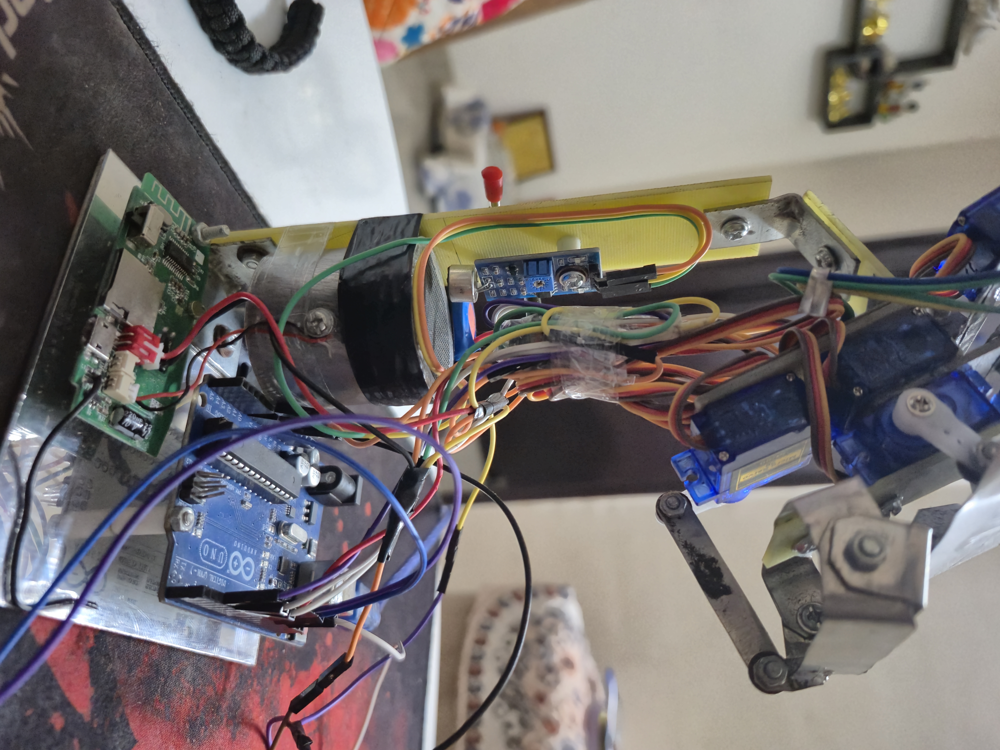
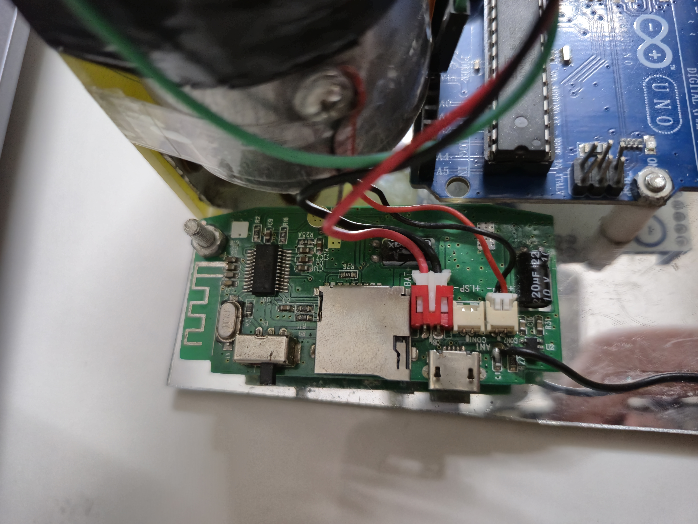
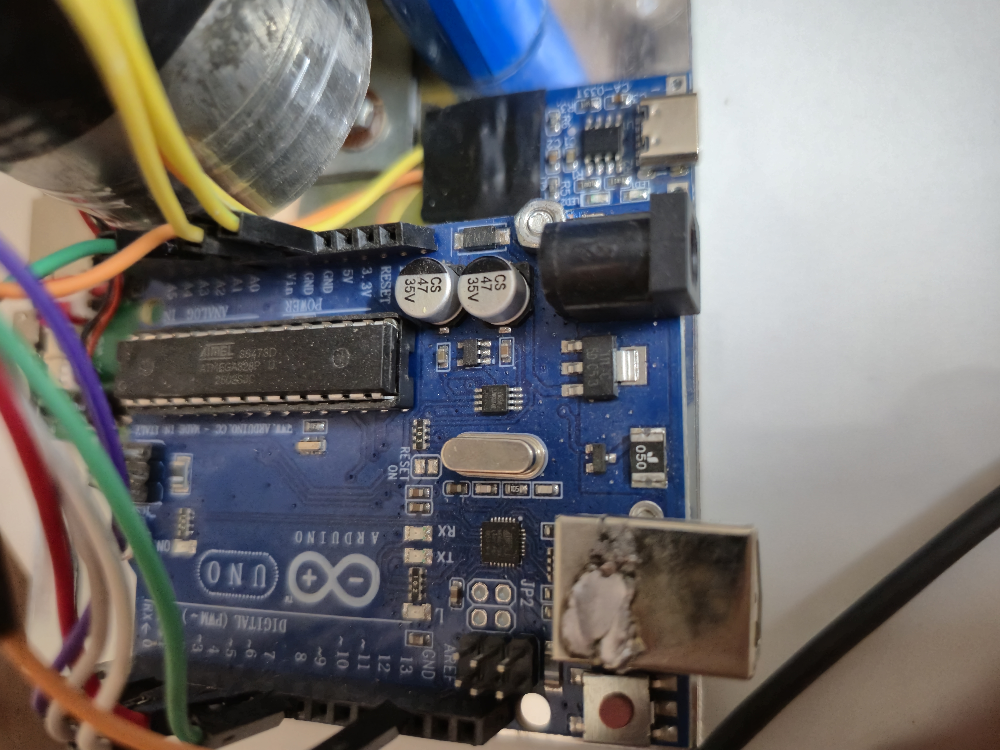

<div align="center">

# 🤖 Brutus AI

### Your AI assistant — with a physical face.

**A fully-featured Windows desktop AI agent that controls a real humanoid robot head over Bluetooth.**

[](https://www.electronjs.org)
[](https://react.dev)
[](https://www.arduino.cc)
[](https://groq.com)
[](https://www.microsoft.com/windows)
[](LICENSE)

---

**Voice conversations** · **Live lip-sync** · **Robot animations** · **OS automation** · **Web search** · **Email** · **Vision** · **Screen share** · **Deep research** · **File control** · **ADB mobile link** · **and more**

---

### 📱 Also on Android?

> Brutus has a **companion mobile app** — a full-featured Android AI assistant with its own robot BLE control, Gemini Live voice, and 25+ tools.
>
> **[→ Check out Brutus Mobile (Android)](https://github.com/Aditya060806/Brutus-app)**

</div>

---

## 📸 See Brutus In Action

<div align="center">

### The Robot Face

<table>
<tr>
<td align="center" width="100%">

<br/><sub><b>Brutus — final build with glowing eyes & servo face</b></sub>
</td>
</tr>
</table>

<br/>

<table>
<tr>
<td align="center" width="33%">

<br/><sub><b>Face close-up — eye & mouth servos</b></sub>
</td>
<td align="center" width="33%">

<br/><sub><b>Early assembly — servo layout & wiring</b></sub>
</td>
<td align="center" width="33%">

<br/><sub><b>Completed assembly — Arduino + HM-10 + servos</b></sub>
</td>
</tr>
</table>

<br/>

### The App (Windows Desktop)

<table>
<tr>
<td align="center" width="50%">

<br/><sub><b>Windows desktop — Brutus command center</b></sub>
</td>
<td align="center" width="50%">

<br/><sub><b>Windows desktop — Brutus executing commands</b></sub>
</td>
</tr>
</table>

</div>

---

## 🌟 What is Brutus?

Brutus is two things in one:

1. **🖥️ A Windows Desktop AI Agent** — Built with Electron + React, powered by open-source LLMs via Groq (LLaMA 3) and local inference via Xenova Transformers. Real-time voice conversations using a fully open-source STT → LLM → TTS pipeline, OS automation, vision, screen control, emails, deep research, and 40+ tools — all through natural speech or text.

2. **🤖 A Physical Robot Head** — An Arduino-powered humanoid face with 4 servos (eyes X/Y, eyelid, mouth), an LED, and a sound sensor. The desktop app drives the robot's expressions, lip-syncs its mouth to the TTS voice output, and triggers named animation sequences — all over Bluetooth Low Energy.

When Brutus talks to you, his robot face **moves its mouth in sync**, changes expressions based on the **emotion in its speech**, and nods, winks, or laughs on command.

> Looking for the **Android / mobile version**? → [**Brutus Mobile App**](https://github.com/Aditya060806/Brutus-app)

---

## 📊 Project At A Glance

<div align="center">

| Metric | Value |
|---|---|
| 🛠️ **AI Tools** | 40+ callable tools |
| 🎭 **Robot Animations** | 20 (10 macros + 10 tricks) |
| 😊 **Expressions** | 6 (+ intensity slider 0–100%) |
| 🔩 **Servos** | 4 × SG90 (eyes X/Y, eyelid, mouth) |
| 📡 **BLE Commands** | 11 command types |
| 📦 **NPM Dependencies** | 50+ packages |
| 🧠 **AI Providers** | Groq (LLaMA 3), HuggingFace, Tavily, local Xenova |
| 🎙️ **Voice Stack** | Whisper STT + Meta MMS / Kokoro TTS (open-source) |
| 🗂️ **Lines of Code (approx.)** | 15,000+ |
| 🏗️ **Architecture** | Electron (main) + React 19 (renderer) + IPC bridge |
| 💾 **Vector DB** | LanceDB (embedded, local-first) |
| 📱 **Mobile Link** | ADB over Wi-Fi (Android deep control) |
| 📱 **Mobile Companion** | [Brutus Android App](https://github.com/Aditya060806/Brutus-app) |

</div>

---

## 🎬 How It Works

```
You speak a command
        │
        ▼
┌──────────────────────────┐
│  Whisper STT (local/API) │  ──── speech → text transcription
└──────────┬───────────────┘
           │
           ▼
┌──────────────────┐      ┌───────────────────┐
│  LLaMA 3 / Groq  │ ◄──► │  Vision / Screen  │
│  (reasoning LLM) │      │  (screenshots)    │
└──────┬───────────┘      └───────────────────┘
        │
┌───────┴──────────────────────┐
│                              │
▼                              ▼
┌──────────────────────┐   ┌──────────────────────┐
│  Meta MMS / Kokoro   │   │  Tool Calls (40+)    │
│  TTS (voice output)  │   │  (OS, web, files,    │
└──────────┬───────────┘   │   ADB, email, etc.)  │
           │               └──────────────────────┘
           ▼
┌────────────────────────┐
│  Robot (BLE via HM-10) │
│  lip-sync + emotion    │
│  + LED patterns        │
└────────────────────────┘
```

---

## 🎙️ Open-Source Voice Stack

Brutus is designed to run a **fully open-source, self-hosted voice pipeline** — no proprietary voice APIs required. The architecture is modular, so each component can be swapped or fine-tuned independently.

### 🔊 Text-to-Speech (TTS) — Brutus's Voice

| Model | Source | Why It Fits |
|---|---|---|
| **Meta MMS-TTS** (VITS) | [facebook/mms-tts](https://huggingface.co/facebook/mms-tts) | Facebook's Massively Multilingual Speech — VITS-based, 1100+ languages, fine-tuneable via HuggingFace Trainer |
| **Kokoro-82M** | [hexgrad/Kokoro-82M](https://huggingface.co/hexgrad/Kokoro-82M) | 82M-param open-weight TTS, Apache 2.0, near-commercial quality, runs on CPU |
| **StyleTTS 2** | [yl4579/StyleTTS2](https://github.com/yl4579/StyleTTS2) | Human-level TTS via style diffusion — zero-shot speaker cloning, emotion control |
| **Coqui XTTS-v2** | [coqui-ai/TTS](https://github.com/coqui-ai/TTS) | Voice cloning from 6s reference clip, 17 languages, actively maintained forks |
| **Piper TTS** | [rhasspy/piper](https://github.com/rhasspy/piper) | Ultra-fast local neural TTS, runs offline on low-end hardware, great for real-time lip-sync |

### 🎤 Speech-to-Text (STT) — Brutus Listens

| Model | Source | Why It Fits |
|---|---|---|
| **OpenAI Whisper** | [openai/whisper](https://github.com/openai/whisper) | MIT-licensed, multilingual, runs fully local — `whisper-base` to `whisper-large-v3` |
| **Whisper.cpp** | [ggerganov/whisper.cpp](https://github.com/ggerganov/whisper.cpp) | C++ port of Whisper — extremely fast on CPU, ideal for real-time desktop use |
| **Meta MMS-ASR** | [facebook/mms-1b-fl102](https://huggingface.co/facebook/mms-1b-fl102) | Wav2Vec2-based ASR for 100+ languages, fine-tuneable with adapter modules |
| **WhisperSpeech** | [WhisperSpeech/WhisperSpeech](https://github.com/WhisperSpeech/WhisperSpeech) | Inverted Whisper — both STT and TTS from the same architecture |

### 🔧 Fine-Tuning Brutus's Voice

The voice pipeline is built to be personalized. To train a custom **"Brutus voice"**:

```bash
# 1. Fine-tune Meta MMS-TTS on your voice dataset using HuggingFace
git clone https://github.com/ylacombe/finetune-hf-vits
pip install -r requirements.txt

# 2. Prepare your audio dataset (10–30 min of clean speech recommended)
# Dataset format: audio files + transcript CSV

# 3. Launch training
python train.py \
  --model_name_or_path "facebook/mms-tts-eng" \
  --dataset_path "./your_voice_dataset" \
  --output_dir "./brutus-voice-model"

# 4. Load the fine-tuned model in Brutus via HuggingFace Inference
```

> The `@xenova/transformers` package already bundled in Brutus can load fine-tuned Whisper and MMS models directly in Node.js — no Python runtime needed at runtime.

### 🔄 Auto-Drive Voice Mode

When the LLM produces a response, Brutus automatically:

| AI Status | Voice Action | Robot Behavior |
|---|---|---|
| 🎧 Listening | Whisper STT active, VAD gating | Eyes center, LED solid |
| 🤔 Thinking | LLM inferencing via Groq | Eyes drift up-left, LED pulse |
| 🗣️ Speaking | MMS/Kokoro TTS → audio chunks → lip-sync | Mouth angle from audio amplitude |
| ⏸️ Idle | Voice pipeline paused | Eyes center, LED pulse |
| ❌ Error | TTS error tone | Sad expression, LED fast blink |

---

## ✨ App Features

### 🎙️ Voice & Conversation

| Feature | Description |
|---|---|
| **Real-time voice** | Open-source STT → LLaMA 3 reasoning → open-source TTS pipeline |
| **Local inference** | Xenova Transformers runs Whisper and small models in-process |
| **Groq fast inference** | LLaMA 3 / Mixtral via Groq for ultra-low latency responses |
| **Text fallback** | Full text chat interface when voice isn't practical |
| **Live transcripts** | See what you and Brutus are saying in real time |
| **Chat history** | Persisted locally via `electron-store` |
| **Context awareness** | Maintains conversation context across sessions |
| **Barge-in** | Interrupt Brutus mid-sentence and the TTS stops immediately |

### 👁️ Vision & Screen

| Feature | Description |
|---|---|
| **Screenshot vision** | Brutus captures your screen and understands what it sees via multimodal AI |
| **Screen Peeler (OCR)** | Instantly extract text from any visible UI element using Tesseract.js |
| **Ghost Coder** | Inline IDE generation triggered by `Ctrl+Alt+Space` |
| **Gallery analysis** | Point at any local image — Brutus describes and reasons about it |

### 🛠️ Tools & Integrations (40+)

<table>
<tr>
<td>

| 📂 **File & OS** |
|---|
| Open / close apps |
| Read / write files |
| Create folders |
| Copy / move / delete |
| Launch files natively |
| Smart Drop Zones |
| Set volume |
| Take screenshot |
| Press shortcuts |

</td>
<td>

| 🌐 **Web & Research** |
|---|
| Web search (Tavily) |
| Deep multi-source research |
| Weather (real-time) |
| Stock prices + compare |
| Build animated websites |
| DOM hacking (Puppeteer) |
| Expose localhost (Wormhole) |
| Notion database sync |

</td>
<td>

| 📧 **Communication** |
|---|
| Gmail — read & compose |
| WhatsApp auto-send |
| Schedule WhatsApp |
| Draft + send emails |
| Notification reader (ADB) |
| Contact lookup |

</td>
<td>

| 🖥️ **Desktop Automation** |
|---|
| Teleport windows |
| Create floating widgets |
| Click at coordinates |
| Scroll screen |
| Phantom Typer |
| Run terminal commands |
| Open IDE projects |
| Execute macros / sequences |

</td>
</tr>
<tr>
<td>

| 🧠 **Memory & Knowledge** |
|---|
| Save core memory |
| Retrieve past context |
| Save / read notes |
| RAG Oracle (doc Q&A) |
| LanceDB vector search |
| Ingest codebase |

</td>
<td>

| 🗺️ **Maps & Media** |
|---|
| OpenStreetMap search |
| Navigation & routing |
| Play Spotify |
| Generate images (HuggingFace) |
| Gallery / image analysis |

</td>
<td>

| 📱 **Mobile (ADB)** |
|---|
| Push / pull files |
| Open / close apps |
| Tap & swipe screen |
| Toggle Wi-Fi / BT / flashlight |
| Read notifications |
| Battery + hardware info |

</td>
<td>

| 🔐 **Security** |
|---|
| Lock system vault (PIN) |
| Biometric face recognition |
| Local key encryption |
| BYOK (bring your own keys) |
| Zero telemetry |

</td>
</tr>
</table>

### 🎨 UI & Design

- **Tailwind CSS v4** with a Neon Emerald aesthetic
- **Framer Motion + GSAP** for cinematic UI animations
- **Three.js + React Three Fiber** for 3D neural visualizations
- **React 19** component-based frontend
- Floating desktop **widgets** that live on top of your workflow
- **Dark-mode map** via Leaflet + OpenStreetMap
- Syntax-highlighted **Monaco Editor** for code output
- XTerm.js **embedded terminal** for live shell output

---

## 🆚 Brutus vs. Typical AI Assistants

<div align="center">

| Capability | Brutus AI | ChatGPT Desktop | Copilot | Standard Chatbots |
|---|:---:|:---:|:---:|:---:|
| Physical robot face w/ lip-sync | ✅ | ❌ | ❌ | ❌ |
| Emotion-driven servo expressions | ✅ | ❌ | ❌ | ❌ |
| 20 named animation macros | ✅ | ❌ | ❌ | ❌ |
| Fully open-source voice pipeline | ✅ | ❌ | ❌ | ❌ |
| Fine-tuneable custom voice | ✅ | ❌ | ❌ | ❌ |
| Real OS file & app control | ✅ | ❌ | ⚠️ Limited | ❌ |
| Ghost typing / tap automation | ✅ | ❌ | ❌ | ❌ |
| ADB mobile deep link | ✅ | ❌ | ❌ | ❌ |
| Screen vision (live OCR) | ✅ | ✅ | ✅ | ❌ |
| Gmail read + compose | ✅ | ❌ | ❌ | ❌ |
| Deep multi-source research | ✅ | ✅ | ⚠️ Limited | ❌ |
| RAG over your own documents | ✅ | ✅ | ❌ | ❌ |
| LanceDB local vector store | ✅ | ❌ | ❌ | ❌ |
| Biometric face-lock vault | ✅ | ❌ | ❌ | ❌ |
| Fully open-source & self-hostable | ✅ | ❌ | ❌ | ❌ |
| Bring-your-own API keys | ✅ | ❌ | ❌ | ❌ |
| Android companion app | ✅ | ❌ | ❌ | ❌ |

> ⚠️ = partial / requires additional setup

</div>

---

## 🤖 Hardware Robot

Brutus has a **physical humanoid face** that brings the AI to life. The robot head uses 4 micro servos, an LED, a sound sensor, and an HM-10 BLE module — all controlled by an Arduino Uno.

### 🔩 Bill of Materials

| Component | Qty | Pin | Purpose |
|---|---|---|---|
| Arduino Uno (or Nano) | 1 | — | Main controller |
| HM-10 BLE Module | 1 | D10 (RX), D11 (TX) | Wireless communication with desktop |
| SG90 Micro Servo — Eye L/R | 1 | D3 | Horizontal eye movement |
| SG90 Micro Servo — Eye U/D | 1 | D5 | Vertical eye movement |
| SG90 Micro Servo — Eyelid | 1 | D6 | Eyelid open/close + blink |
| SG90 Micro Servo — Mouth | 1 | D9 | Jaw / lip-sync |
| LED (any color) | 1 | D8 | Status indicator / emotion display |
| Sound Sensor (analog) | 1 | A0 | Mic for idle mode autonomous lip-sync |
| 5V Power Supply (2A+) | 1 | — | Power for servos (USB alone isn't enough) |

**💰 Estimated Build Cost: ~$15–25 USD** (Arduino clone + 4× SG90 + HM-10 + LED + misc)

### 🔌 Wiring Diagram

```
┌──────────────────────┐
│     Arduino Uno      │
│                      │
HM-10 TXD ─────► │ D10 (SoftSerial RX)  │
HM-10 RXD ◄───── │ D11 (SoftSerial TX)  │ ← use 5V→3.3V voltage divider!
│                      │
Eye L/R Servo ◄── │ D3  (PWM)            │
Eye U/D Servo ◄── │ D5  (PWM)            │
Eyelid Servo  ◄── │ D6  (PWM)            │
Mouth Servo   ◄── │ D9  (PWM)            │
│                      │
LED           ◄── │ D8  (Digital)        │
Sound Sensor  ──► │ A0  (Analog)         │
│                      │
5V (external) ──► │ 5V                   │
GND ───────────── │ GND (common ground)  │
└──────────────────────┘
```

> ⚠️ **Important:** The HM-10's RXD pin is **3.3V logic**. Use a voltage divider (1kΩ + 2kΩ) between Arduino D11 (5V TX) and HM-10 RXD. TXD → Arduino D10 is fine without a divider.

### 📡 BLE Protocol

The desktop app communicates with the robot over BLE GATT serial (UUID `0000FFE1`). Commands are newline-terminated ASCII:

| Command | Description | Example |
|---|---|---|
| `E<n>` | Set expression (0–5) | `E0` = Happy |
| `E<n>,<i>` | Expression with intensity (0–100) | `E1,50` = slightly angry |
| `M<a>` | Mouth angle (0–180) for lip-sync | `M140` |
| `L<lr>,<ud>` | Eye look-at (both axes, 0–180) | `L60,70` |
| `B` | Trigger a blink | `B` |
| `I<0\|1>` | Idle fallback on/off | `I1` |
| `S<0\|1>` | Freeze mode (disable all autonomous) | `S1` |
| `A<n>` | Play animation macro (0–9) | `A3` = Wink |
| `W<n>` | Play movement trick (0–9) | `W5` = Jaw Drop |
| `C<n>` | LED pattern (0=off, 1=solid, 2=pulse, 3=fast) | `C2` |
| `H` | Heartbeat — replies `OK\n` | `H` |

### 😊 Expressions (E command)

| Index | Expression | Description |
|---|---|---|
| 0 | 😊 Happy | Relaxed eyes, slight smile |
| 1 | 😠 Angry | Squinted eyes, jaw clenched |
| 2 | 😢 Sad | Droopy eyes, averted gaze, frown |
| 3 | 🤔 Thinking | Eyes up-left, neutral mouth |
| 4 | 😴 Sleepy | Nearly closed eyes, relaxed |
| 5 | 😲 Surprised | Max wide eyes + mouth open |

Each expression can be dialed from **0% (neutral)** to **100% (full)** using the intensity parameter. The formula: `servo_target = 90 + (preset - 90) × intensity / 100`.

### 🎭 Animation Macros (A command)

10 pre-baked multi-step animation sequences stored on the Arduino. Each runs as a **non-blocking keyframe sequence** — the robot stays responsive to new commands while animating.

| Index | Name | What It Does |
|---|---|---|
| A0 | 🙌 Nod | Head bobs up/down (yes) |
| A1 | 🙅 Shake | Head turns left/right (no) |
| A2 | 👀 Look Around | Dramatic room scan |
| A3 | 😉 Wink | Quick eyelid close-open with smile |
| A4 | 🥱 Yawn | Big mouth, sleepy eyes, slow close |
| A5 | 😂 Laugh | Rapid mouth flutter with happy eyes |
| A6 | 🙄 Eye Roll | Dramatic circular eye sweep |
| A7 | 💬 Mouth Cycle | Rhythmic open-close |
| A8 | 👁️ Eye Cycle | Eyelids open-close rhythmically |
| A9 | 🕺 Wiggle | Playful side-to-side jiggle |

### 🎪 Movement Tricks (W command)

| Index | Name | What It Does |
|---|---|---|
| W0 | 🫨 Crazy Eyes | Rapid random eye darting |
| W1 | 🦷 Chatter | Teeth-chattering mouth |
| W2 | 🔍 Slow Scan | Dramatic slow left-to-right pan |
| W3 | 🙈 Peek-a-boo | Eyes shut tight → surprise pop open |
| W4 | ✨ Double Blink | Two quick blinks |
| W5 | 😱 Jaw Drop | Dramatic slow mouth open + shock face |
| W6 | 😴 Drowsy | Drift to sleep, then snap awake |
| W7 | 😒 Side Eye | Suspicious side glance |
| W8 | 🤩 Happy Bounce | Excited bouncing motion |
| W9 | 🤔 Confused | Uncertain tilting and looking around |

### 🗣️ Voice-Triggered Animations

The LLM can trigger robot animations through natural speech via tool calls:

> *"Brutus, nod your head"* → plays Nod animation  
> *"Wink at them"* → plays Wink animation  
> *"Do crazy eyes"* → plays Crazy Eyes trick  
> *"Act confused"* → plays Confused trick  

---

## 🏗️ Architecture

```
brutus-ai/
├── src/
│   ├── main/                  # Electron Main Process (Node.js)
│   │   ├── index.ts           # App entry, IPC registration, BLE manager
│   │   ├── handlers/          # IPC tool handlers (PhantomControl, ScreenPeeler, SmartDropZone)
│   │   ├── logic/             # Core logic modules (40+ tools)
│   │   │   ├── adb-manager.ts       # ADB over Wi-Fi mobile control
│   │   │   ├── ghost-control.ts     # Phantom typing & keyboard injection
│   │   │   ├── telekinesis.ts       # Desktop window management
│   │   │   ├── reality-hacker.ts    # Puppeteer DOM manipulation
│   │   │   ├── permanent-memory.ts  # LanceDB vector memory
│   │   │   ├── gmail-manager.ts     # Gmail read/compose
│   │   │   ├── file-ops.ts          # File system operations
│   │   │   └── ...                  # 20+ more logic modules
│   │   └── auto/
│   │       ├── website-builder.ts   # Agentic GSAP/Tailwind site gen
│   │       └── widget-manager.ts    # Floating desktop widget spawner
│   ├── preload/               # Context isolation + IPC bridge
│   └── renderer/              # React 19 frontend
│       ├── src/
│       │   ├── components/    # UI components (widgets, visualizations)
│       │   ├── pages/         # Feature screens
│       │   ├── store/         # Zustand global state
│       │   └── styles/        # Tailwind v4 + custom CSS
├── assets/                    # Screenshots, build photos, Arduino files
│   ├── Display_Emotion.ino    # Arduino firmware for robot face
│   └── eyes.h                 # Eye servo constants
├── resources/                 # App icons
├── .env.example               # API key template
├── electron.vite.config.ts    # Vite split-process config
└── electron-builder.yml       # Windows .exe packaging config
```

### Tech Stack

| Layer | Technology |
|---|---|
| **Desktop runtime** | Electron 41.x + electron-vite |
| **Frontend** | React 19 + Tailwind CSS v4 |
| **State** | Zustand |
| **Animations** | Framer Motion + GSAP 3 |
| **3D visuals** | Three.js + React Three Fiber |
| **LLM reasoning** | Groq SDK (LLaMA 3 / Mixtral) |
| **Local inference** | `@xenova/transformers` (Whisper, small LMs) |
| **TTS (voice out)** | Meta MMS-TTS / Kokoro-82M / StyleTTS2 via `@huggingface/inference` |
| **STT (voice in)** | OpenAI Whisper via `@xenova/transformers` or whisper.cpp |
| **Image generation** | `@huggingface/inference` (SDXL / Stable Diffusion) |
| **Vector DB** | LanceDB (embedded, local-first) |
| **Web automation** | Puppeteer + puppeteer-extra-stealth |
| **OS automation** | Nut.js (mouse, keyboard, coordinates) |
| **OCR** | Tesseract.js (eng.traineddata) |
| **Code editor** | Monaco Editor |
| **Terminal** | XTerm.js |
| **Maps** | Leaflet + React Leaflet (OpenStreetMap) |
| **Charts** | Recharts |
| **Auth / Google** | `@google-cloud/local-auth` + `googleapis` |
| **Notion** | `@notionhq/client` |
| **Web search** | `@tavily/core` |
| **Face recognition** | `face-api.js` |
| **BLE (robot)** | Node.js BLE via serial bridge to HM-10 |

---

## 📱 Android Phone Setup (ADB)

Brutus connects to your Android phone wirelessly using **ADB over Wi-Fi (TCP/IP)**. You only need a USB cable **once** for first-time setup.

> **Prerequisites:** Your PC and phone must be on the **same Wi-Fi network**, and `adb` must be installed.  
> Download [Android Platform Tools](https://developer.android.com/tools/releases/platform-tools) and add the extracted folder to your Windows PATH.

### Step 1 — Enable Developer Options

1. Go to **Settings → About Phone**
2. Tap **Build Number** 7 times rapidly
3. Go to **Settings → Developer Options → Enable USB Debugging**

### Step 2 — Connect via USB *(first time only)*

Plug your phone in. Approve the **"Allow USB debugging?"** dialog on your phone.

### Step 3 — Start the Wireless ADB Daemon

```bash
adb tcpip 5555
```

You should see: `restarting in TCP mode port: 5555`

### Step 4 — Find Your Phone's IP

Go to **Settings → Wi-Fi → tap your network → IP Address** (e.g. `192.168.1.47`)

### Step 5 — Connect in Brutus

1. Unplug USB
2. Open Brutus → **PHONE** tab → **NEW DEVICE**
3. Enter your phone's IP and port `5555`
4. Click **ESTABLISH CONNECTION**

Brutus will remember and auto-reconnect on next launch.

### ⚠️ Common Issues

| Problem | Fix |
|---|---|
| *"Connection refused"* | You skipped Step 3 — run `adb tcpip 5555` via USB first |
| Can't find `adb` | [Download Platform Tools](https://developer.android.com/tools/releases/platform-tools), extract, add folder to PATH |
| IP keeps changing | Set a **static IP** in your phone's Wi-Fi settings |
| Phone not detected | Try a different USB cable (data cable, not charge-only) |

---

## 🚀 Getting Started

### Prerequisites

- **Node.js 18+**
- **Windows 10 / 11**
- A **Groq API key** (free) from [Groq Console](https://console.groq.com) for LLaMA 3
- *(For robot)* Arduino IDE + hardware listed above

### 1. Clone the repo

```bash
git clone https://github.com/Aditya060806/Brutus.git
cd Brutus
```

### 2. Install dependencies

```bash
npm install
```

### 3. Configure API keys

Copy the template and fill in your keys:

```bash
cp .env.example .env
```

Minimum required in `.env`:

```env
MAIN_VITE_GROQ_API_KEY="your_groq_api_key"    # LLaMA 3 reasoning
VITE_BRUTUS_AI_API_KEY="your_gemini_api_key"  # optional fallback
```

Full setup (unlocks all features):

```env
VITE_IMAGE_AI_API_KEY="your_huggingface_api_key"   # image gen + MMS/Kokoro TTS
VITE_TAVILY_API_KEY="your_tavily_api_key"           # web search + research
VITE_NOTION_API_KEY="your_notion_key"               # Notion sync
VITE_NOTION_DATABASE_ID="your_notion_database_id"
```

For Gmail / Google auth, set up a backend server (see `backend.env.example`):

```env
PORT=4000
GOOGLE_CLIENT_ID="your_google_client_id"
GOOGLE_CLIENT_SECRET="your_google_client_secret"
GOOGLE_CALLBACK_URL="http://localhost:4000/users/google/callback"
JWT_ACCESS_SECRET="your_jwt_access_secret"
JWT_REFRESH_SECRET="your_jwt_refresh_secret"
```

> Add `http://localhost:4000/users/google/callback` as an Authorized redirect URI in [Google Cloud Console](https://console.cloud.google.com).

### 4. Run in development

```bash
npm run dev
```

### 5. Build for Windows

```bash
npm run build:win
```

### 6. Upload Arduino firmware (for robot)

1. Open `assets/Display_Emotion.ino` in Arduino IDE
2. Select **Arduino Uno** (or your board)
3. Upload the sketch
4. Power servos with an **external 5V 2A+ supply**
5. In Brutus, go to **Robot Control → Scan → tap your HM-10 device** to connect

> **Note:** The HM-10 typically advertises as `HMSoft`, `BT05`, or `MLT-BT05`. No pairing needed — it's BLE, not classic Bluetooth.

---

## 🔑 API Keys Reference

| Key | Required | Purpose | Get it |
|---|---|---|---|
| `MAIN_VITE_GROQ_API_KEY` | ✅ | LLaMA 3 / Mixtral reasoning (fast, free tier) | [Groq Console](https://console.groq.com/keys) |
| `VITE_IMAGE_AI_API_KEY` | ✅ | HuggingFace — MMS TTS + image gen | [HuggingFace Tokens](https://huggingface.co/settings/tokens) |
| `VITE_TAVILY_API_KEY` | 🟡 | Deep web research | [Tavily Portal](https://app.tavily.com/home) |
| `VITE_BRUTUS_AI_API_KEY` | 🟡 | Gemini AI fallback (optional) | [Google AI Studio](https://aistudio.google.com/app/apikey) |
| `VITE_NOTION_API_KEY` | 🟡 | Notion database sync | [Notion Integrations](https://www.notion.so/my-integrations) |
| Google OAuth | 🟡 | Gmail read/compose | [Google Cloud Console](https://console.cloud.google.com) |

---

## 💻 System Requirements

| Component | Minimum | Recommended |
|---|---|---|
| **OS** | Windows 10 | Windows 11 |
| **RAM** | 4 GB | 8 GB (for heavy RAG indexing + local TTS) |
| **Storage** | 3.5 GB | 5 GB+ (for vector DB + TTS model weights) |
| **Node.js** | 18.x | 20.x LTS |
| **GPU** | Not required | CUDA GPU speeds up local Whisper + StyleTTS2 |

---

## 🗺️ Roadmap

- [ ] 🎤 Custom wake word ("Hey Brutus") via Porcupine or openWakeWord
- [ ] 🦜 Fine-tuned Brutus voice model (Meta MMS-TTS trained on custom dataset)
- [ ] 🔊 StyleTTS2 integration for emotion-expressive voice output
- [ ] 🧠 Fully offline mode — local Whisper + local LLM (Ollama / llama.cpp)
- [ ] 🍎 macOS + Linux support
- [ ] 🔌 Plugin marketplace for community tools
- [ ] 🕸️ Memory graph visualization
- [ ] 🤝 Multi-agent collaboration mode
- [ ] 🌈 Neopixel RGB LED strip for true color emotions
- [ ] 🦾 Neck pan/tilt servo for head tracking
- [ ] ☁️ Desktop + Cloud hybrid sync
- [ ] 📱 Deeper integration with [Brutus Android app](https://github.com/Aditya060806/Brutus-app)

---

## 🔒 Security

- **100% BYOK** — Bring Your Own Keys. Your API keys never leave your machine.
- **Local encryption** — Keys stored via OS keychain / `electron-store`.
- **Zero-trust** — No external key storage, no telemetry, no phone-home.
- **Face-lock vault** — Optional biometric face recognition via `face-api.js` to restrict access.
- **Open-source voice** — No audio sent to proprietary voice APIs. STT and TTS run locally.

---

## 🤝 Contributing

Contributions are welcome! Feel free to open issues or submit pull requests.

1. Fork the repository
2. Create your feature branch: `git checkout -b feature/amazing-feature`
3. Copy `.env.example` → `.env` and fill in your keys
4. Match existing patterns (Tailwind for UI, strict IPC typing for the backend)
5. Test thoroughly — ensure tools do not block the Electron main thread
6. Commit: `git commit -m 'feat: add amazing feature (#45)'`
7. Push: `git push origin feature/amazing-feature`
8. Open a Pull Request with a clear description and screenshots if UI is changed

Read the full [Contribution Guide](CONTRIBUTING.md) before submitting.

---

## 🌐 Brutus Ecosystem

| Project | Platform | Description |
|---|---|---|
| **Brutus AI** (this repo) | 🖥️ Windows Desktop | Electron + React desktop agent with robot BLE control |
| **[Brutus Mobile](https://github.com/Aditya060806/Brutus-app)** | 📱 Android | Flutter app with Gemini Live, robot BLE, and 25+ tools |

---

## ⚠️ Disclaimer

Brutus has deep system-level execution capabilities — file writes, OS automation, ADB mobile control, and web automation. Use responsibly. The maintainers are not liable for misuse.

---

## 👤 Author

**Aditya Pandey** — AI Systems Engineer

- GitHub: [@Aditya060806](https://github.com/Aditya060806)
- LinkedIn: [Aditya Pandey](https://www.linkedin.com/in/aditya-pandey-p1002/)
- Email: aditya060806@gmail.com

---

## 📄 License

This project is licensed under the MIT License. See [LICENSE](LICENSE) for details.

---

<div align="center">

**Built with ❤️ using Electron, React, LLaMA, Meta MMS, and Arduino**

*Brutus AI — Because your AI assistant deserves a face.*

</div>
